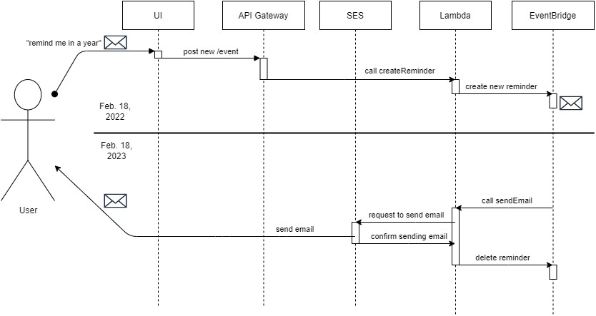

# Remind Me In

Create a reminder. The app will email you later.


## Build
#### For local development
```bash
npm install
npm start
```
Access the UI at http://localhost:3000.


#### For production build
```bash
npm install
npm run build
```
The final build will be in the `build` directory.


## Diagram

The UI sends a request to AWS API Gateway. Then the gateway forwards the request to AWS Lambda, triggering the `createReminder` function. The function creates a scheduled event in AWS EventBridge, using a cron expression.

At the scheduled time, the event will trigger the `sendEmail` function. This function sends a request to AWS Simple Email Service to send an email with the reminder. Once the email is sent, the event is deleted.

The Lambda functions are [here.](https://github.com/kwoner61/aws-lambda-functions)




This project was bootstrapped with [Create React App](https://github.com/facebook/create-react-app).